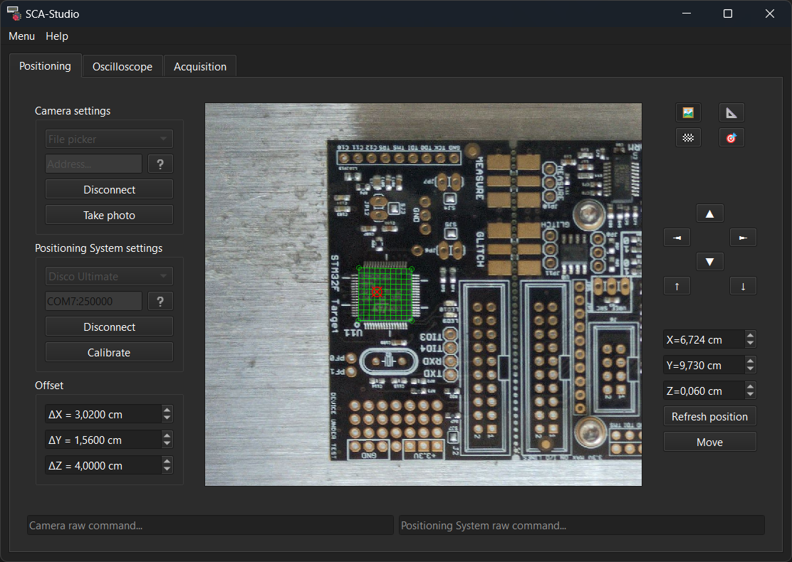

<p align="center"></p>

# SCA-Studio

SCA-Studio is a tool for performing acquisitions for side-channel attack benches. It focuses on electromagnetic attacks, with partial support for fault injection.

<p align="center"></p>

## Features
SCA-Studio allows you to move your hardware with a camera and a positioning system, configure your oscilloscope, and perform automated acquisitions through an area of interest.

SCA-Studio is highly modular to easily add your own hardware devices. It already supports:
- Camera: USB camera, file picker
- Positioning system: Disco Ulimate 3D printer
- Oscilloscope: Tektronix TDS (tested with TDS7704B)
- Target board: Nucleo boards with a test firmware, ChipWhisperer with simpleserial-aes firmware

Documentation is available in French in `docs`, and can be opened directly from the app.

## Installation
Clone the repo:

```
git clone https://github.com/Petitoto/SCA-Studio
cd SCA-Studio
```

Install Python dependencies:
```
pip install -r requirements.txt
```

Finally, run `SCA-Studio.pyw` to launch the app.